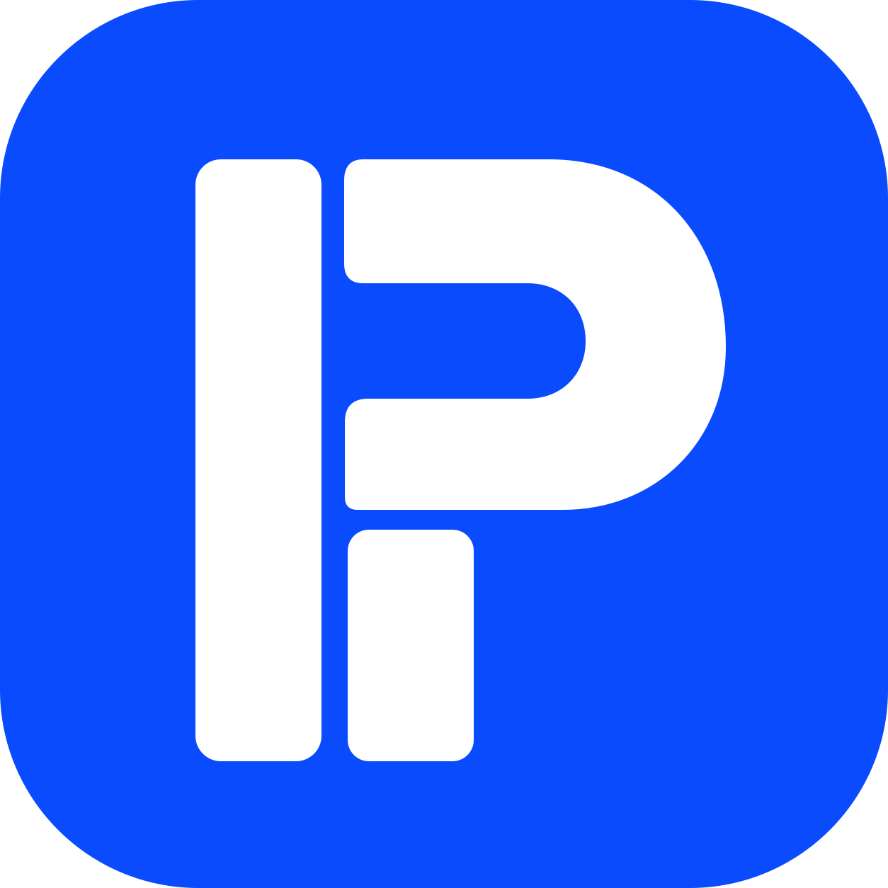

<p align="center">
  
</p>

<h1 align="center">Plan It</h1>

<p align="center">
  <strong>Think it through. Then build it.</strong><br />
  Planning tools for the part of a project that happens before the first commit.
</p>

<p align="center">
  <a href="https://planit.iamsamarth.xyz"></a>
  <a href="LICENSE"></a>
  <a href="https://github.com/bugsum/planit/releases"></a>
  
  
</p>

Most planning apps are built around executing work. Plan It is built around
shaping it — the backlog you rewrite three times, the ideas that are not tasks
yet, the structure you want settled before you start typing. Kanban is the first
planner; Mindmap and Roadmap are next.

## Features

**Kanban**

- Multiple boards, each with its own columns, cards and labels
- Columns you define: rename, reorder, delete, optional WIP limits
- Cards with description, colored labels, priority and due dates
- Drag and drop for cards and columns
- Keyboard-first: select, move, duplicate, delete and re-prioritise cards without the mouse
- Right-click context menus on cards, columns, boards and empty space
- Undo and redo for every board edit
- Search and filter by text, label or priority
- Export a board to JSON and import it back

Press <kbd>?</kbd> anywhere in the app for the full list of shortcuts.

Everything is stored locally in your browser, so there is no account and no
server. Boards travel as JSON files.

## Getting started

Requires [Bun](https://bun.com).

```bash
bun install
bun run dev
```

Open [http://localhost:3000](http://localhost:3000).

```bash
bun run build   # production build
bun run lint    # eslint
```

## Tech

Next.js 16 (App Router) · React 19 · TypeScript · Tailwind CSS v4 · zustand ·
pragmatic-drag-and-drop

## Project structure

```
src/
  app/                 routes
  components/ui/       generic primitives (buttons, dialogs, context menu)
  components/app/      app shell and shortcut guide
  components/home/     homepage sections
  components/kanban/   the Kanban planner
  store/               zustand stores, one per planner, plus UI state
  helpers/             utilities, keybindings and the persistence adapter
  types/               shared types
```

Persistence lives behind a single adapter in `src/helpers/storage.ts`, so moving
boards to a backend later does not touch the UI. See
[docs/architecture.md](docs/architecture.md) for the full picture.

## Roadmap

- [x] Kanban boards
- [ ] Mindmaps
- [ ] Roadmap / timeline view
- [ ] Sync across devices

## License

[MIT](LICENSE)
